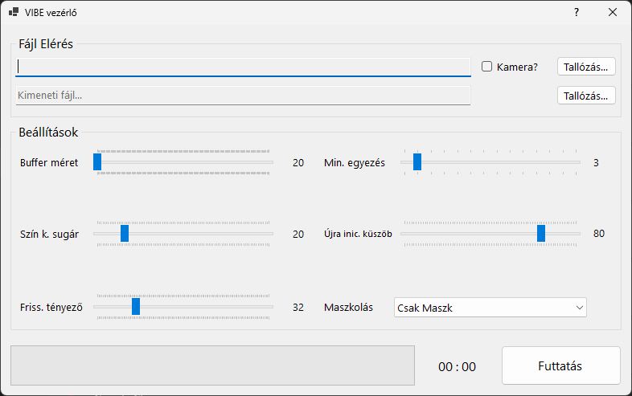
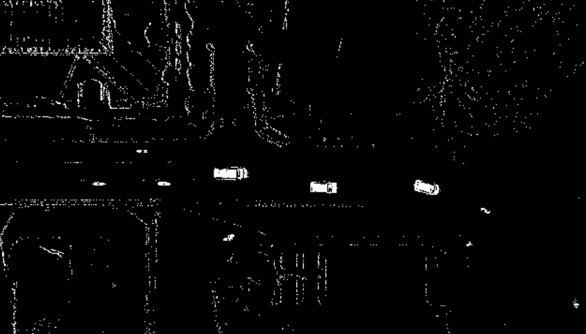

# ViBe-SzL-CH

Ez a program videó háttér, vagy előtér eltávolításra szolgál.
Ezen művelet elvégzéséhez az ismert ViBe algoritmus megvalósítást használja.
A program támogatja a többmagos működést, és SIMD utasításkészletet használ!

A szoftver rendelkezik grafikus és konzolos felülettel is.

A program sima megnyitása a grafikus felületet hozza előtérbe.
A konzolból történő meghíváskor "--console" attribútum hozzáadásával hivható meg a konzolos felület.
A program felület nélkül is futtatható a forrás és cél fájl megadásával, amihez az "--src" és a "--dst" attribútumokat használhatjuk.

A program kamerából is tud dolgozni.

A program futásának eredménye:

Fejlesztők:
 - Grafikus felület: Szoboszlai László
 - Konzolos felület: Christopher Babulic
